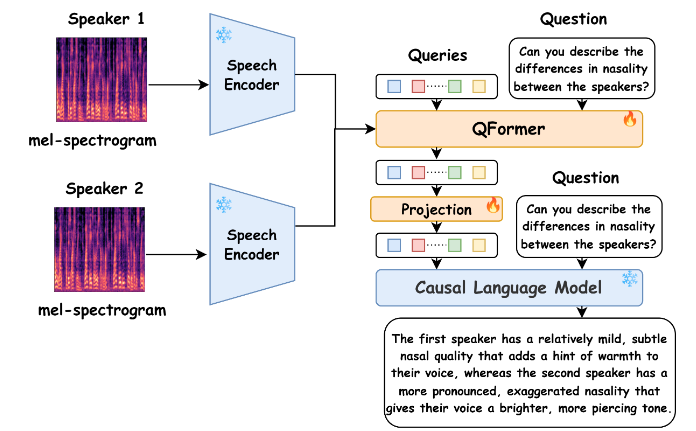

I am a graduate student from Carnegie Mellon University with a Specialized focus in AI/ML. I have extensive knowledge and experience in building deep learning models for different tasks such as Speech Language Model, Vision/Speech Models for Verification, etc. and have implemented them in various fields such as security, language models, and navigations. 
  
<h1>Interests</h1>
<table style="border: none; border-collapse: collapse;">
  <tr>
    <td style="padding: 10px; border: none; vertical-align: top; font-size: 18px;">
      <b>I primarily focus on using deep learning models for various tasks expecially in the domain of Speech and Vision with Integrating in Language Models.</b> 
      I suggest you explore my projects featured on <a href="https://syedabdulhannan27.github.io/page/projects/">Projects</a> page.
    </td>
  </tr>
  <tr>
    <td style="padding: 10px; border: none;">
      

        
      

    </td>
  </tr>
</table>