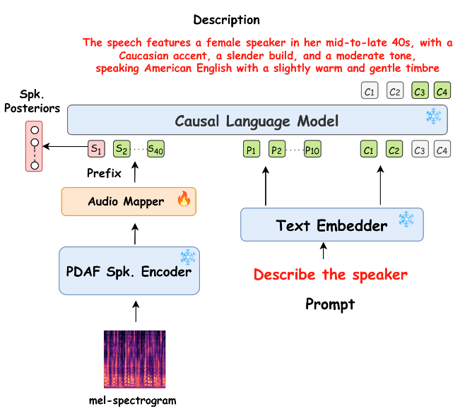
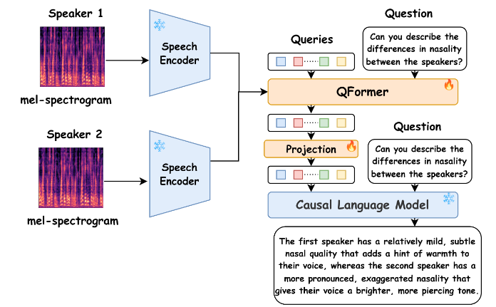
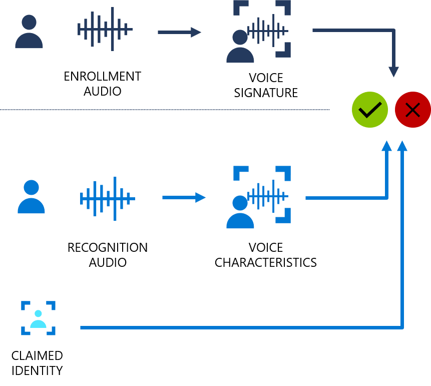
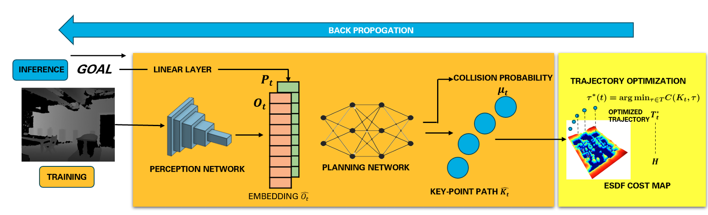

## CoLMbo: Enhancing Speaker Profiling with AI
<table style="border: none; border-collapse: collapse;">
    <tr>
        <td style="padding: 0px; border: none;">
            

                
            

        </td>
    </tr>
    <tr>
        <td style="padding: 10px; border: none; vertical-align: top; font-size: 16px;">
            <b>June 2024 - September 2024</b> 
            This project introduces CoLMbo, an innovative Speaker Language Model designed to generate descriptive speaker profiles in natural language. By integrating a robust speaker encoder with prompt-based conditioning, CoLMbo can produce detailed captions that capture attributes such as age, gender, accent, and dialect. The model's ability to adapt to user-defined prompts makes it versatile for various applications, including forensics, customer service, and healthcare. CoLMbo leverages advanced language modeling techniques and speaker embeddings to provide context-rich and explainable profiles, setting a new benchmark in speaker recognition systems.
             
            <a href = "https://syedabdulhannan27.github.io/page/project_desc/COLMBO">More</a>
        </td>
    </tr>
</table>
---

---

## CoLMbo-SV: Redefining Explainable Speaker Verification
<table style="border: none; border-collapse: collapse;">
    <tr>
        <td style="padding: 0px; border: none;">
            

                
            

        </td>
    </tr>
    <tr>
        <td style="padding: 10px; border: none; vertical-align: top; font-size: 16px;">
            <b>September 2024 - November 2024</b> 
            CoLMbo-SV is an advanced Speaker Language Model designed to transform traditional speaker verification systems. By leveraging a Q-Former module and integrating with a Large Language Model (LLM), CoLMbo-SV provides comprehensive and explainable voice comparisons. It evaluates two speech inputs to analyze both voice quality and inferred personality traits, such as loudness, breathiness, and OCEAN personality dimensions.

            This system enhances reliability and transparency in speaker verification tasks by generating natural language explanations that highlight key similarities and differences between speakers. With applications in identity authentication, CoLMbo-SV sets a new benchmark for combining audio processing with natural language interpretation, bridging the gap between technical precision and user-friendly insights.
             
            <a href = "https://syedabdulhannan27.github.io/page/project_desc/COLMBOSV">More</a>
        </td>
    </tr>
</table>
---

## AVIS: Accelerating Speaker Verification with a Versatile Framework
<table style="border: none; border-collapse: collapse;">
    <tr>
        <td style="padding: 0px; border: none;">
            

                
            

        </td>
    </tr>
    <tr>
        <td style="padding: 10px; border: none; vertical-align: top; font-size: 16px;">
            <b>June 2024 - September 2024</b> 
            Engineered a highly adaptable Speaker Verification Framework designed to integrate seamlessly with a variety of state-of-the-art models, datasets, augmentation techniques, and feature extractors. Key achievements include:

            Implemented support for comprehensive evaluation metrics such as Equal Error Rate (EER) and accuracy to enable detailed performance analysis.
            Optimized training workflows using PyTorch Lightning, leveraging distributed multi-GPU support for faster and scalable model development.
            Achieved a 30% reduction in training time compared to standard PyTorch frameworks, enabling rapid experimentation across models and configurations.
            This framework pushes the boundaries of flexibility and efficiency, setting a new standard for speaker verification research and application.
             
            <a href = "https://sjhpark.github.io/project_desc/RAG">More</a>
        </td>
    </tr>
</table>
---

## Learning-Based Perceptive Policy for Robot Navigation
<table style="border: none; border-collapse: collapse;">
    <tr>
        <td style="padding: 0px; border: none;">
            

                
            

        </td>
    </tr>
    <tr>
        <td style="padding: 10px; border: none; vertical-align: top; font-size: 16px;">
            <b>June 2023 - December 2023</b> 
            This project introduced a unified framework for real-time robot navigation by integrating perception and path planning into a single pipeline. A pre-trained Convolutional Variational Autoencoder (CVAE) was utilized to extract meaningful features from depth images while reducing noise, enhancing the accuracy of downstream tasks. The planning network employed LSTM networks to capture spatiotemporal dependencies, enabling the generation of smooth, dynamically feasible trajectories.

            Trained in high-fidelity simulation environments like Gazebo and Matterport3D, the framework achieved an 88% navigation success rate in challenging scenarios, thanks to advanced data augmentation techniques that bridged the sim-to-real gap. This lightweight and efficient architecture ensures real-time performance, paving the way for future hardware implementations in complex, real-world environments.
             
            <a href = "https://sjhpark.github.io/project_desc/DRONE">More</a>
        </td>
    </tr>
</table>
---