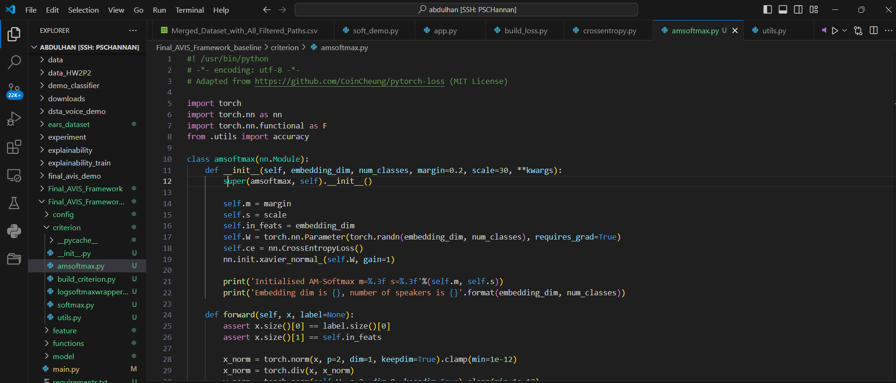

<h2>Motivation</h2> 
Speaker verification is essential for applications such as identity authentication and personalized voice interfaces.
<h2>Introduction</h2> 

    

However, many existing systems are inflexible, limited to specific datasets, models, or evaluation metrics. The AVIS framework was developed to address these challenges by providing a versatile, scalable solution adaptable to various state-of-the-art models, datasets, augmentation techniques, and feature extractors. Its objective is to streamline experimentation and improve performance across diverse speaker verification scenarios.
  
<h2>Methods</h2> 
The AVIS framework is built on the PyTorch Lightning platform, enabling efficient distributed training on multi-GPU setups. This architecture accelerates training by 30% compared to traditional PyTorch workflows. The framework supports key metrics like Equal Error Rate (EER) and accuracy, allowing robust performance evaluation. It incorporates advanced augmentation techniques and modular integration with different speaker models, ensuring adaptability and scalability.
  
<h2>Results</h2> 
The framework demonstrated significant improvements in training efficiency and flexibility, successfully accommodating various state-of-the-art models and achieving competitive EER results across multiple datasets. The modular design allowed seamless experimentation with different feature extractors and evaluation pipelines, reducing setup time and computational overhead.
  
<h2>Discussion</h2> 
AVIS provides a transformative solution for the speaker verification community by addressing the need for a unified, adaptable framework. Its support for diverse models and datasets makes it ideal for research and production environments. My role included designing the framework’s architecture, implementing distributed multi-GPU training, and optimizing performance evaluation processes.
  
<h2>Conclusion</h2> 
The AVIS framework represents a step forward in speaker verification research, enabling faster experimentation and broader adaptability. Future iterations will focus on integrating more advanced models, supporting real-time applications, and extending its capabilities to novel tasks in speaker analysis.

    

