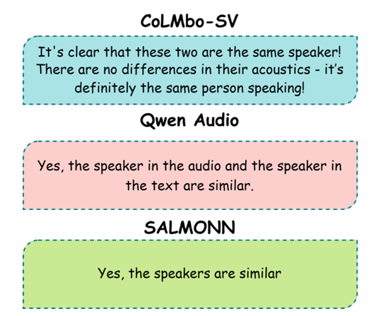

<h2>Motivation</h2> 
Speaker verification plays a vital role in identity authentication but often lacks transparency, providing only basic match or mismatch results.
<h2>Introduction</h2> 

    

CoLMbo-SV addresses these limitations by introducing a speaker language model that compares two speech inputs, analyzing both voice quality (e.g., loudness, breathiness) and inferred personality traits (e.g., OCEAN dimensions). The objective is to enhance speaker verification with explainable, nuanced assessments that bridge audio analysis and natural language interpretation.
  
<h2>Methods</h2> 
The system integrates a Q-Former module with a Large Language Model (LLM) to generate contextualized comparisons. The Q-Former extracts features from a fixed speaker encoder (ECAPA-TDNN) and aligns them with language embeddings. These embeddings enable the LLM to generate detailed natural language responses. CoLMbo-SV was trained on the VoxCeleb dataset, leveraging paired speech samples, low-level acoustic features, and textual prompts.
  
<h2>Results</h2> 
CoLMbo-SV outperformed competing models (QwenAudio, SALMONN) in both speaker verification accuracy (100%) and explainability. Its natural language outputs provide detailed insights into speaker traits, offering a comprehensive comparison. The model excels in tasks requiring fine-grained voice quality analysis and personality inference.
  
<h2>Discussion</h2> 
CoLMbo-SV sets a new standard for explainable speaker verification, offering applications in security, forensic analysis, and user-centric voice interfaces. My role involved designing the Q-Former module, fine-tuning the integration with the LLM, and conducting performance evaluations. The framework provides scalability for incorporating new traits and features, though challenges remain in modeling context-dependent speech variability.
  
<h2>Conclusion</h2> 
This project demonstrates how integrating audio-language representation enhances both the accuracy and interpretability of speaker verification systems. Future work will focus on handling large-scale comparisons and addressing contextual variability in speech.

    

