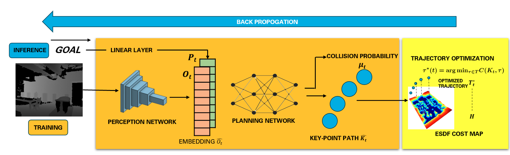

<h2>Motivation</h2> 
Navigating real-world environments remains a critical challenge for autonomous robots, especially in unstructured or dynamic settings.
<h2>Introduction</h2> 

    

This project aimed to develop a robust and efficient framework that integrates perception and path planning into a unified pipeline. The objective was to enhance robot navigation by generating smooth, safe, and dynamically feasible trajectories while addressing sensory noise and latency issues in traditional systems.
  
<h2>Methods</h2> 
The framework employs a pre-trained Convolutional Variational Autoencoder (CVAE) to extract noise-free, low-dimensional features from depth images, enhancing the perception capabilities of the robot. The extracted features are combined with goal representations and passed through a Long Short-Term Memory (LSTM) network, which leverages spatiotemporal dependencies to plan efficient paths. The system was trained entirely in simulation environments such as Gazebo and Matterport3D, with data augmentation techniques like blur, noise injection, and gamma correction to bridge the sim-to-real gap. A Bi-Level Optimization (BLO) process was applied to ensure paths met safety and dynamic feasibility requirements.
  
<h2>Results</h2> 
The system achieved an 88% navigation success rate, comparable to baseline models such as iPlanner (86%) while excelling in complex scenarios with larger obstacles. Despite being lightweight and optimized for real-time performance, the model outperformed in terms of planning logic, particularly in obstacle-dense environments, thanks to the integration of spatiotemporal dependencies and advanced feature extraction.
  
<h2>Discussion</h2> 
This project highlights the social value of autonomous navigation systems, offering applications in search and rescue, delivery services, and mobility solutions in inaccessible areas. By reducing computational overhead and enhancing navigation reliability, this framework paves the way for real-world deployment. My role involved designing the CVAE-based perception module, implementing the LSTM planner, and conducting extensive testing and performance evaluation in simulated environments.
  
<h2>Conclusion</h2> 
The proposed framework provides a significant advancement in autonomous navigation by effectively addressing challenges in dynamic environments. Future work will focus on dynamic adjustment of key path parameters and deploying the system on physical hardware to validate its robustness under real-world conditions.

    

