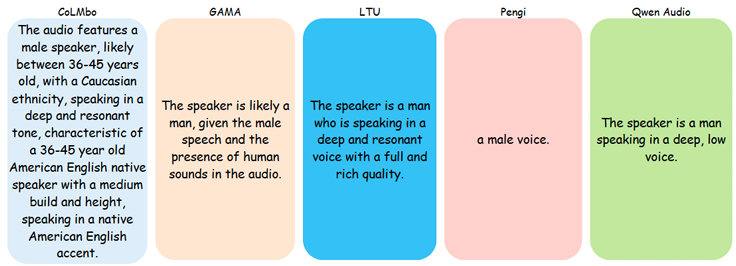

<h2>Motivation</h2> 
CoLMbo addresses the limitations of traditional speaker recognition systems by providing rich, descriptive speaker profiles through an innovative Speaker Language Model (SLM).
<h2>Introduction</h2> 

    

By integrating speaker embeddings with prompt-based conditioning, CoLMbo generates customized and context-aware descriptions, such as dialect, gender, and age, offering significant advancements in speaker profiling applications like forensics, customer service, and healthcare.
  
<h2>Methods</h2> 
The model uses a fixed PDAF encoder to derive speaker embeddings and a lightweight transformer-based audio mapper to create prefixes. These prefixes are input to a frozen causal language model to generate natural language descriptions. CoLMbo also includes a speaker classifier for clustering embeddings and a dual-loss training strategy, balancing text generation accuracy and speaker identification.
  
<h2>Results</h2> 
The model outperforms state-of-the-art systems, achieving near-perfect accuracy for predicting speaker attributes, including gender (100%) and accent (100%). Generated descriptions demonstrate high lexical and semantic similarity to reference data, with BERTScore (0.97) and METEOR (0.7) metrics validating its effectiveness.
  
<h2>Conclusion</h2> 
CoLMbo’s ability to produce detailed, adaptable, and interpretable speaker profiles bridges the gap between traditional recognition systems and advanced profiling needs, setting a new benchmark for speaker language models. Future work will explore broader applications and the inclusion of complex speaker traits, such as emotional states and vocal health indicators.

    

